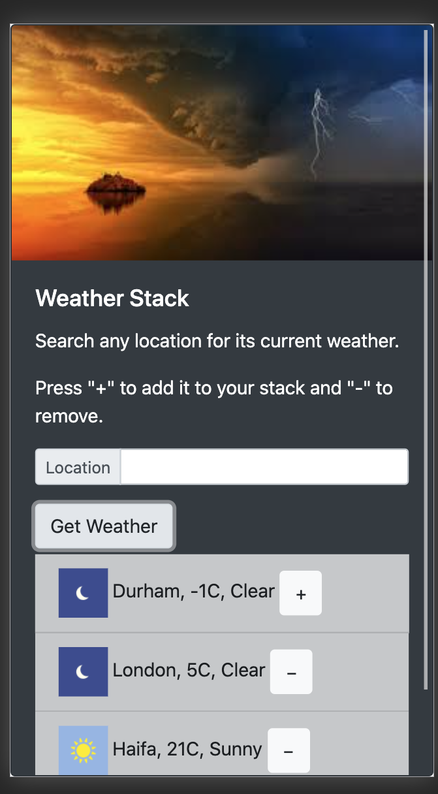

# Weather Stack - weather web application
- This project was created with vanilla JS in the client-side, Node.js - express server and MongoDB database.
- This project UI was created using [Bootstrap](https://getbootstrap.com/).

## General description
- The user can search for a location for weather and save it to his location shortlist.
- Bundling is done using Webpack. 
- Geo-location is done using [Mapbox](https://www.mapbox.com/) API and weather data using [Weatherstack](https://weatherstack.com/) API. 

### `npm run dev`
- Runs the app in the development mode.
- Open [http://localhost:8080](http://localhost:8080) to view it in the browser.

## App screenshots
<h1 align="center">
    
    
</h1>